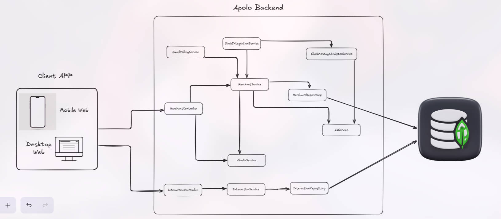
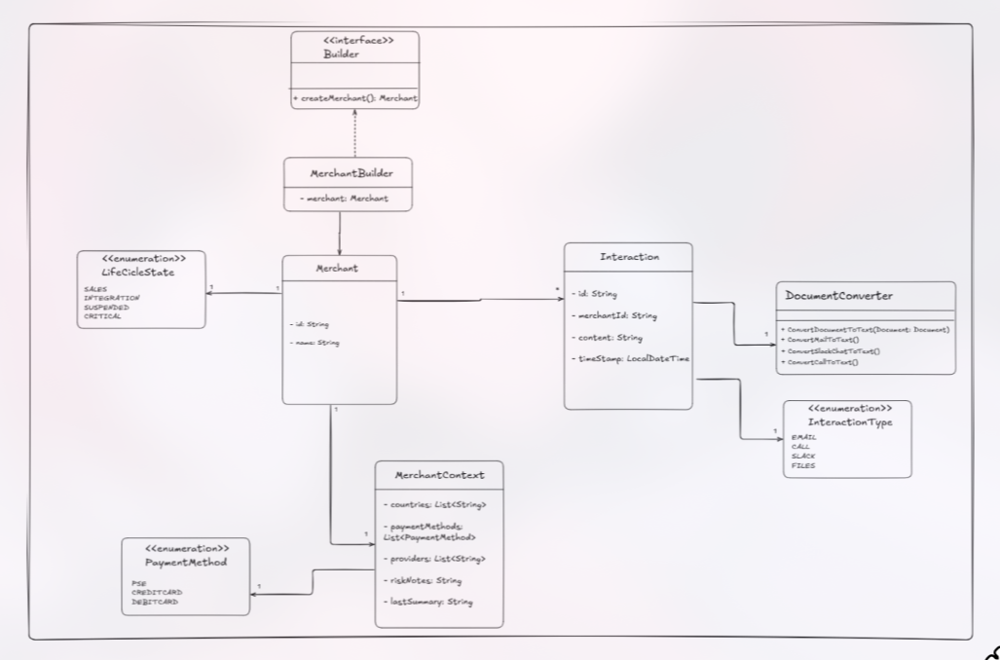

# 🚀 ApoloBackend

**Backend for the Apolo project (Yuno Hackathon)** — A Spring Boot service that integrates Artificial Intelligence capabilities for risk profile analysis.

---

## 👥 Team

* **Juan Sebastian Puentes Julio**
* **Daniel Patiño Mejia**
* **Tulio Riaño Sánchez**
* **Isaac Burgos**

---

## 🎨 Design & Architecture

This section illustrates the system architecture. The images are stored in `docs/diagrams/`.

### 🧩 General Component Diagram
High-level view of system components and integrations (Frontend, API, AI Services, DB, External APIs).


### ⚙️ Specific Component Diagram
Detailed backend components: Controllers, Services (`AIService`, `GladiaService`), Repositories, and Mappers.



### 🗄️ Database Model
Database schema showing the `Merchant`, `Interaction`, and `RiskProfile` entities and their relationships.


### 📦 Class Diagram
Important domain classes (Entities, Enums and  Pattern Designs) and their relationships.



---

## ℹ️ General Overview

This repository contains a Spring Boot backend (Java 17) that exposes REST endpoints and integrates with external AI services. It uses MongoDB for persistence and exposes API documentation via Swagger/OpenAPI.

### 🛠️ Technical Details
* **Java:** 17 ☕
* **Framework:** Spring Boot 🍃
* **Build Tool:** Maven 🐘
* **Database:** MongoDB 🍃
* **API Documentation:** Swagger UI (springdoc) 📜

---

## 📋 Prerequisites

To run this project you need:

1.  **Java 17** or newer.
2.  **Maven 3.6+**.
3.  A **MongoDB** instance (local or cloud).

---

## ⚙️ Configuration

The application reads configuration from `src/main/resources/application.properties` by default.

> **⚠️ IMPORTANT:** Sensitive values (API Keys, DB credentials) should **never** be committed to the repository. It is recommended to use environment variables.

**Key Properties:**
* `spring.data.mongodb.uri`: MongoDB connection URI.
* `openai.api.key`: OpenAI API Key.
* `gladia.api.key`: Gladia API Key.

### Running with Environment Variables (Recommended)

#### 1️⃣ Using Maven (Dev)

```bash
export OPENAI_API_KEY="your-openai-key"
export GLADIA_API_KEY="your-gladia-key"
export MONGODB_URI="your-mongodb-uri"

mvn spring-boot:run -Dspring-boot.run.jvmArguments="-Dopenai.api.key=$OPENAI_API_KEY -Dgladia.api.key=$GLADIA_API_KEY -Dspring.data.mongodb.uri=$MONGODB_URI"

```

#### 2️⃣ Build and Run JAR (Prod)

```bash
mvn clean package -DskipTests

java -Dopenai.api.key="$OPENAI_API_KEY" -Dgladia.api.key="$GLADIA_API_KEY" -Dspring.data.mongodb.uri="$MONGODB_URI" -jar target/ApoloBackend-0.0.1-SNAPSHOT.jar

```

### 🚀 Common Commands

- Build (with tests)

```bash
mvn clean package
```

- Build (skip tests)

```bash
mvn clean package -DskipTests
```

- Run Tests

```bash
mvn test
```